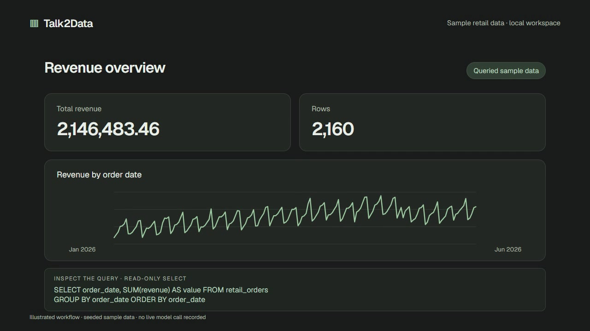

# Talk2Data

A local data investigation workbench. Ask questions about SQL databases or uploaded files, clarify what you mean, and inspect dashboards backed by actual read-only queries.

Built with Next.js, Vercel AI Elements, AI SDK agents, json-render, and a FastAPI adapter for the Python data engine. Reflex has been removed.

## Demo

[](brag-output/brag.mp4)

**[Watch the 22-second demo](brag-output/brag.mp4)** · [Storyboard](brag-output/brag-plan.md) · [Share copy](brag-output/share-copy.txt)

Created with the installed [Brag skill](https://github.com/latent-spaces/brag) and Hyperframes. The demo recreates the working prompt → metric clarification → revenue dashboard → SQL inspection flow. Its **2,146,483.46 total revenue and 2,160 rows** come from queries against the seeded retail source. It uses no private data. This is an illustrated product workflow, not a recording of a live model call.

## Run locally

Use **Node.js 22.18+** and **Python 3.11+**.

```bash
python -m venv .venv
source .venv/bin/activate # PowerShell: .\.venv\Scripts\Activate.ps1
pip install -r requirements.txt
npm ci
```

Copy `.env.example` to `.env`; the defaults work without a model. Then start both services in separate terminals:

```bash
# Terminal 1, with the Python environment activated
npm run api

# Terminal 2
npm run dev
```

Open [localhost:3000](http://localhost:3000). The engine creates **Sample retail data** on first launch. Configuration, uploads, and history live under `~/.talk2data/`; override with `TALK2DATA_HOME`. Both services bind to loopback: frontend 3000, Python API 8000. `TALK2DATA_API_URL` overrides the proxy target. `npm run build` and `npm start` run the production frontend. Hosting the frontend alone does not host the Python engine or local files.

## Try it

- Select **Sample retail data** and ask `Which region has the most revenue?` or `Show revenue over time`.
- Choose **Build a dashboard**, the sidebar **+**, or `/dashboard revenue`. Answer missing table/metric questions, inspect each widget's SQL, then save it. Reopening a saved dashboard queries fresh data from its saved source and request.
- Ask `Why did revenue drop?`, or choose **Investigate a change** to select a table, date, measure, breakdown, and equal 7/14/28-day windows. Save the settings and rerun the generated `/check_ID` command. Export the evidence as JSON.
- Use `/forecast` for a seasonal naive forecast with holdout evaluation, `/anomaly` for median-based outlier checks, or `/profile` for a data profile.
- Upload CSV, TSV, XLSX, Parquet, JSON, or JSONL, limited to 30 MB and 150 columns.
- Connect a SQLAlchemy source with a **read-only database account**. SQLite and PostgreSQL are the first target dialects; other dialects need drivers and validation.
- Open **Skills & MCP** to add custom instructions or HTTPS/local streamable HTTP servers. Each MCP call shows exact arguments and requires explicit approval.

## Agents and interface

Two server-side AI SDK `ToolLoopAgent` configurations share a small tool boundary:

| Agent | Available tools | Output |
|---|---|---|
| Analysis | `getSchema`, `addUserQuestions`, `runAnalysis`, `investigateChange` | Queried table/chart or deterministic evidence |
| Dashboard | `getSchema`, `addUserQuestions`, `createDashboard` | Validated metric, chart, table, and note widgets |

Schema inspection comes first. The selected source is pinned outside model tool arguments. Runs stop after six model steps, twelve tool calls, or sixty seconds. Failed queries can be corrected; invalid calls cannot silently return stale earlier results. The UI displays checked tool activity and renders engine output rather than model-generated values or prose. MCP tools are never called automatically.

Dashboard plans use an allowlisted json-render catalog. The engine validates the entire layout and every SQL statement before executing queries, fills widgets from real results, and caps charts/records at 200 rows. Saved dashboards store settings, not generated SQL.

The minimal chat interface composes official AI Elements messages, Markdown, conversation scrolling and prompt input with shadcn/Radix controls, Lucide icons, Recharts and self-hosted Geist fonts. Dark mode follows your system setting; the header toggle saves your preference. Advanced controls appear when needed. Table exports include visible rows; evidence exports include the complete investigation payload.

## Configure a model

Without a provider, the app uses clearly labeled starter queries and dashboard overviews. Tool-using agents require a compatible chat-completions model with function/tool calling support. Configure these server-side variables in `.env` and restart **both** services:

```dotenv
TALK2DATA_LLM_URL=http://127.0.0.1:1234/v1/chat/completions
TALK2DATA_LLM_MODEL=your-model-id
# Optional for a remote provider:
TALK2DATA_LLM_KEY=your-key
```

The existing endpoint URL is preserved, including custom paths. Explicit slash commands retain the Python engine's deterministic behavior and custom-skill handling.

A configured model receives the selected schema, question, clarification answers and up to four recent conversation summaries/queries. Analysis tools can send summaries and **up to ten preview rows per query** back to the model. Dashboard tools return completion metadata while full widget data stays local. A remote provider therefore receives those bounded observations. Keys and database connection URLs stay server-side.

Every query must validate as one read-only SELECT. Use read-only database permissions as a separate control. SQLAlchemy credentials are stored in the local workspace database in this version; OS key storage is not implemented.

## Evidence and limits

Change investigations compare one numeric metric across equal windows and inspect calendar completeness, missing values, row counts, earlier periods, freshness and segment contributions. Contributions are arithmetic, **not causal**. Breakdowns with more than 40 categories are skipped instead of silently truncated. Large remote tables can still incur substantial query cost; prefer indexed date columns.

Cross-source joins, vector databases, scheduled investigations, model training and general autonomous ML are outside the current scope. Custom skills guide prompts without executing arbitrary scripts. `/ml` produces a baseline assessment.

For qualifying noncommercial, nonproduction TimesFM 3 experiments, install the official TimesFM package and PyTorch dependencies, then set `TALK2DATA_FORECAST_PROVIDER=timesfm3`, `TALK2DATA_TIMESFM_NONCOMMERCIAL=1`, and optionally `TALK2DATA_TIMESFM_DEVICE=cpu`. The engine checks local resources and holdout accuracy, retaining the baseline when it performs better. See the separate [TimesFM license](https://github.com/google-research/timesfm).

## Verify

```bash
python -m unittest discover -s tests -v
npm run test:agents
npm run typecheck
npm run build
```

Validation for this delivery: **28 Python tests and 13 agent tests passed**, TypeScript checked, and the production frontend built. Agent tests use the AI SDK mock provider to cover schema-first execution, source pinning, clarification, dashboard materialization, query corrections, invalid-call recovery, stale-result rejection, saved reruns and step limits. The browser flow was checked with starter data; no live provider was exercised.

## Recreate the demo

The editable composition and public sample data are in `brag-output/composition/`. Use FFmpeg/ffprobe on your PATH and a Chrome browser. The composition's scripts pin Hyperframes 0.8.91:

```bash
cd brag-output/composition
npm run check
npm run render -- --quality delivery --output ../brag.mp4 --workers 1
```

The delivered composition passed Hyperframes runtime, layout and contrast checks with zero errors. Its poster is selected from the settled dashboard and baked into frame zero. Fonts, GSAP and audio are local; asset attribution is in [CREDITS.md](brag-output/composition/assets/CREDITS.md). Brag installation provenance is retained in `skills-lock.json`; install it again with `npx skills add https://github.com/latent-spaces/brag --skill brag --agent codex -y`.
